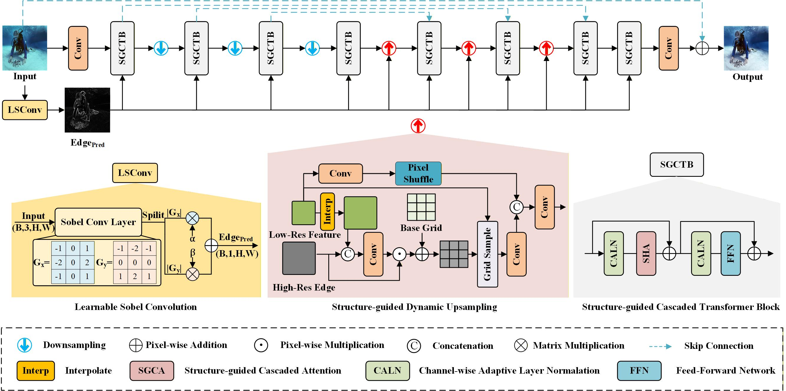

# SATNet — Structure-Aware Transformer Network for Underwater Image Enhancement

Official implementation of the paper:

> **Preserving Structural Integrity: A Structure-Aware Framework for Underwater Perception**
>
> Jie Xu, Junyu Fan, Chuanlin Liao, Yi Lin
>
> ACM Multimedia 2026 (MM '26)
>


SATNet is a U-shaped Transformer network for underwater image enhancement.
Unlike pixel-wise reconstruction methods, it explicitly models structural
information (edges, boundaries and spatial layouts) to bridge low-level pixel
restoration and high-level semantic understanding, while preserving structure
throughout the enhancement process.

## News

- **2026-08-04**: Initial release. Code, training/testing scripts and ablation
  models are provided.

## Network Architecture



The network consists of a U-shaped Transformer backbone and a learnable
Sobel-based branch for structure extraction. Structure-aware representations
are injected into every stage to guide feature learning. The backbone is built
upon Transformer blocks, while a structure-guided dynamic upsampling module is
adopted in the decoder to refine details.

### Core Modules

| Module | Description |
| --- | --- |
| **LSConv** | Learnable Sobel Convolution — reformulates the Sobel operator as learnable convolutional kernels with adaptive gradient-response modulation, producing stable edge representations that guide subsequent feature learning. The predicted edge maps are supervised with an L1 loss during training. |
| **SCTB** | Structure-guided Cascaded Transformer Block — cascaded attention with adaptive layer normalization. A first self-attention stage aggregates global context for pixel-wise restoration; a second stage injects the structural priors from LSConv to guide feature refinement. |
| **SDU** | Structure-guided Dynamic Upsampling — uses high-resolution edge representations to guide the upsampling of low-resolution features, adaptively adjusting sampling locations for sharper boundaries and finer details. |

## Results

All quantitative results below are reported in the paper (Tables 1 and 3).

### Full-Reference Datasets (PSNR / SSIM / LPIPS)

| Method | Test-U90 (UIEB) | | | Test-L400 (LSUI) | | |
| --- | --- | --- | --- | --- | --- | --- |
| | PSNR ↑ | SSIM ↑ | LPIPS ↓ | PSNR ↑ | SSIM ↑ | LPIPS ↓ |
| FUnIE | 19.504 | 0.709 | 0.201 | 18.050 | 0.721 | 0.230 |
| Ushape | 22.066 | 0.910 | 0.157 | 20.031 | 0.790 | 0.196 |
| SpecFormer | 25.113 | 0.927 | 0.110 | 21.091 | 0.843 | 0.185 |
| SFGNet | 18.805 | 0.828 | 0.161 | 19.269 | 0.764 | 0.234 |
| GHSUIR | 24.709 | 0.925 | 0.074 | 21.998 | 0.854 | 0.193 |
| Aqua | 25.278 | 0.930 | 0.069 | 21.623 | 0.848 | 0.188 |
| CDFNet | 25.295 | 0.923 | 0.076 | 21.775 | 0.846 | 0.184 |
| WWE-UIE | 24.959 | 0.919 | 0.077 | 21.863 | 0.846 | 0.187 |
| UWEnhancer | 25.370 | 0.930 | 0.066 | 22.011 | 0.855 | 0.182 |
| **SATNet (Ours)** | **25.926** | **0.931** | **0.063** | **22.338** | **0.854** | **0.177** |

### Non-Reference Datasets (UIQM / UCIQE)

| Method | Test-C60 (UIEB Challenge) | | Test-E330 (EUVP) | | Test-U300 (UCCS) | |
| --- | --- | --- | --- | --- | --- | --- |
| | UIQM ↑ | UCIQE ↑ | UIQM ↑ | UCIQE ↑ | UIQM ↑ | UCIQE ↑ |
| FUnIE | 3.081 | 0.568 | 2.944 | 0.585 | 3.078 | 0.546 |
| Ushape | 2.778 | 0.556 | 2.911 | 0.578 | 3.028 | 0.543 |
| SpecFormer | 2.675 | 0.564 | 2.920 | 0.582 | 2.997 | 0.534 |
| SFGNet | 2.764 | 0.515 | 2.978 | 0.529 | 3.009 | 0.476 |
| GHSUIR | 2.751 | 0.573 | 3.030 | 0.582 | 3.083 | 0.544 |
| Aqua | 2.737 | 0.584 | 2.850 | 0.596 | 3.006 | 0.538 |
| CDFNet | 2.802 | 0.583 | 2.933 | 0.599 | 3.085 | 0.544 |
| WWE-UIE | 2.885 | 0.579 | 2.957 | 0.599 | 3.115 | 0.547 |
| UWEnhancer | 2.718 | 0.581 | 2.993 | 0.600 | 2.992 | 0.547 |
| **SATNet (Ours)** | 2.666 | **0.584** | 2.900 | **0.600** | 2.966 | **0.547** |

### Complexity (256 × 256 input)

| FLOPs | Params | Inference time |
| --- | --- | --- |
| 24.48 G | 3.60 M | ≈ 0.07 s |

### Ablation Study (Test-U90)

| LSConv | SDU | SCTB | FLOPs | Params | PSNR ↑ | SSIM ↑ |
| --- | --- | --- | --- | --- | --- | --- |
| ✗ | ✗ | ✗ | 11.39 G | 1.76 M | 24.530 | 0.915 |
| ✓ | ✓ | ✗ | 13.88 G | 1.92 M | 25.101 | 0.922 |
| ✓ | ✗ | ✓ | 21.99 G | 3.44 M | 25.550 | 0.923 |
| ✗ | ✓ | ✓ | 24.48 G | 3.60 M | 25.673 | 0.927 |
| ✓ | ✓ | ✓ | 24.48 G | 3.60 M | **25.926** | **0.931** |

## Datasets

Following the paper, SATNet is trained on 800 paired images from the **UIEB**
dataset and evaluated on both full-reference and non-reference test sets:

| Test set | Source | Reference |
| --- | --- | --- |
| Test-U90 | Remaining 90 paired images of UIEB | Li et al., *An Underwater Image Enhancement Benchmark Dataset and Beyond*, IEEE TIP 2019 |
| Test-L400 | 400 randomly selected pairs of LSUI | Peng et al., *U-shape Transformer for Underwater Image Enhancement*, IEEE TIP 2023 |
| Test-E330 | EUVP | Islam et al., *Fast Underwater Image Enhancement for Improved Visual Perception*, IEEE RA-L 2020 |
| Test-U300 | UCCS | Liu et al., *Real-world Underwater Enhancement: Challenges, Benchmarks, and Solutions under Natural Light*, IEEE TCSVT 2020 |
| Test-C60 | UIEB Challenge subset | Li et al., IEEE TIP 2019 |

Metrics: PSNR / SSIM / LPIPS for full-reference datasets; UIQM and UCIQE for
non-reference datasets.

## Installation

```bash
conda create -n satnet python=3.9
conda activate satnet
pip install -r requirements.txt
```

A GPU is recommended (training defaults to CUDA).

## Data Preparation

Arrange each dataset as paired folders with matching file names:

```text
datasets/
├── UIEB/                  # Test-U90
│   ├── train/
│   │   ├── input/         # degraded underwater images (800 pairs)
│   │   └── gt/            # reference images
│   └── test/
│       ├── input/         # remaining 90 pairs
│       └── gt/
├── LSUI/                  # Test-L400
│   └── test/
│       ├── input/
│       └── gt/
├── EUVP/                  # Test-E330 (no reference)
│   └── test/input/
├── UCCS/                  # Test-U300 (no reference)
│   └── test/input/
└── UIEB_Challenge/        # Test-C60 (no reference)
    └── test/input/
```

During training, images are randomly cropped to patches (default 256 × 256)
with flip augmentation, and a Sobel/Canny edge map is computed from each GT
image to supervise the edge prediction branch.

## Training

```bash
python train.py \
    --dataroot_lq ./datasets/UIEB/train/input \
    --dataroot_gt ./datasets/UIEB/train/gt \
    --Val_lq ./datasets/UIEB/test/input \
    --Val_gt ./datasets/UIEB/test/gt \
    --save_path ./experiments \
    --n_epochs 500 \
    --cuda_id 0
```

The total loss follows the paper:

```text
L = L1 + λ1 * L_per + λ2 * L_grad + L_edge
```

where `L1` is the Charbonnier loss, `L_per` is the VGG19 perceptual loss,
`L_grad` is the image gradient loss, `L_edge` supervises the edge maps
predicted by LSConv, and `λ1 = λ2 = 0.1`.

During training, the script:

- saves a checkpoint every `--n_save` epochs to `experiments/<model_name>/model/`;
- evaluates on the validation set every epoch and keeps the best PSNR/SSIM
  weights in `experiments/<model_name>/best/`;
- writes sample validation images to `experiments/<model_name>/images/`.

## Testing

```bash
# Full-reference evaluation (e.g. Test-U90)
python test.py \
    --Val_lq ./datasets/UIEB/test/input \
    --Val_gt ./datasets/UIEB/test/gt \
    --ckpt ./experiments/SATNet/best/best_psnr.pth \
    --save_path ./results \
    --cuda_id 0

# Non-reference evaluation (e.g. Test-E330, omit --Val_gt)
python test.py \
    --Val_lq ./datasets/EUVP/test/input \
    --ckpt ./experiments/SATNet/best/best_psnr.pth \
    --save_path ./results \
    --cuda_id 0
```

The script reports PSNR / SSIM / LPIPS (requires `lpips`) for full-reference
sets and UIQM for all sets, and saves the enhanced images to `--save_path`.
Input images of arbitrary size are automatically padded to a multiple of 8.


## Directory Structure

```text
.
├── train.py                  # training entry point
├── test.py                   # testing / evaluation entry point
├── requirements.txt
├── models/
│   └── satnet.py             # full SATNet model
├── data/
│   └── structure_dataset.py  # datasets and edge-map generation
├── losses/
│   ├── losses.py             # Charbonnier / gradient / perceptual / edge losses
│   └── ssim.py               # SSIM implementation
├── metrics/
│   └── uiqm_utils.py         # UIQM metric
├── utils/
│   └── edge_utils.py         # offline edge-map generation (WB + CLAHE + Canny/Sobel)
├── ablation/                 # ablation study models
├── legacy/                   # early-stage scripts (reference only)
├── paper/                    # the paper PDF
└── Figures/
    └── Pipeline.jpg          # network architecture figure
```

## Acknowledgement

This code is built upon the U-shaped Transformer architecture of
[**Restormer**](https://github.com/swz30/Restormer):

> Syed Waqas Zamir, Aditya Arora, Salman Khan, Munawar Hayat, Fahad Shahbaz
> Khan, and Ming-Hsuan Yang, "Restormer: Efficient Transformer for
> High-Resolution Image Restoration," CVPR 2022.

Restormer is released under the MIT License. We thank the authors for sharing
their code. Please refer to the Restormer repository for the original license
terms.

We also thank the authors of the public datasets used in this work (UIEB,
LSUI, EUVP, UCCS) and the authors of UIQM and UCIQE metrics.

## Citation

If you find this work useful in your research, please cite:

```bibtex
@inproceedings{xu2026satnet,
  author    = {Xu, Jie and Fan, Junyu and Liao, Chuanlin and Lin, Yi},
  title     = {Preserving Structural Integrity: A Structure-Aware Framework for Underwater Perception},
  booktitle = {Proceedings of the 34th ACM International Conference on Multimedia (MM '26)},
  year      = {2026},
  address   = {Rio de Janeiro, Brazil},
  doi       = {10.1145/3767308.3836323}
}
```

## License

The paper is licensed under a Creative Commons Attribution 4.0 International
License. The code license will be added here before release; please contact
the authors for usage before then. Parts of the code derived from Restormer
remain subject to the Restormer MIT license.
